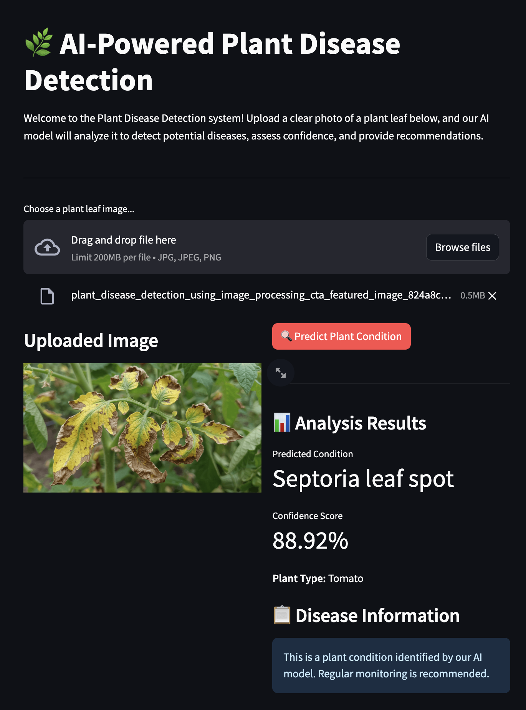
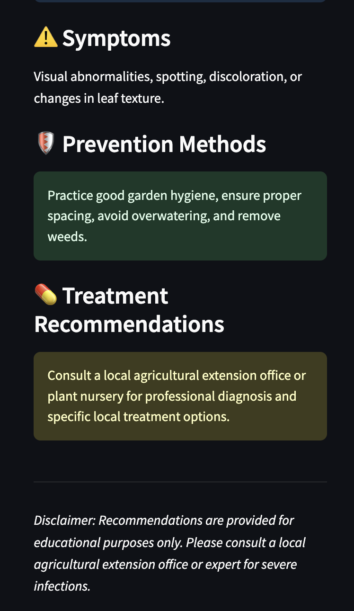

# AI-Powered Plant Disease Detection

An AI-powered web application that detects plant diseases from leaf images and provides useful information about symptoms, prevention, and possible treatment options.

The application uses a deep learning model built with **TensorFlow/Keras** and provides an interactive interface using **Streamlit**. Users can upload a plant leaf image and receive a predicted disease along with a confidence score and disease-related recommendations.

---

## Application Screenshots

### Home View / Upload Interface



### Prediction and Recommendation Results



---

## Features

- Upload plant leaf images in JPG, JPEG, or PNG format
- AI-powered plant disease prediction
- Confidence score for predictions
- Image preprocessing and normalization
- Disease symptoms and information
- Prevention recommendations
- Treatment suggestions
- Interactive and user-friendly Streamlit interface

---

## Project Structure

```text
AI-Powered-Plant-Disease-Detection/
│
├── data/
│   └── Dataset references and information
│
├── models/
│   └── plant_model_weights.weights.h5
│
├── notebooks/
│   └── plant_disease_training.ipynb
│
├── src/
│   ├── __init__.py
│   ├── predict.py
│   ├── preprocess.py
│   └── disease_info.py
│
├── class_indices.json
├── app.py
├── requirements.txt
├── so1.png
├── so2.png
└── README.md
```

---

## How It Works

The application follows the workflow below:

```text
Plant Leaf Image
       ↓
Image Upload
       ↓
Image Preprocessing
       ↓
Resize to 224 × 224
       ↓
Normalization
       ↓
Deep Learning Model
       ↓
Disease Prediction
       ↓
Confidence Score
       ↓
Symptoms, Prevention & Treatment Recommendations
```

### 1. Image Preprocessing

The uploaded plant image is processed using `src/preprocess.py`.

The image is:

- Resized to `224 × 224` pixels
- Converted into the required format
- Normalized for the deep learning model
- Prepared as an array for prediction

### 2. Disease Prediction

The prediction process is handled by `src/predict.py`.

The application uses a deep learning model based on the **MobileNetV2** architecture. The trained model weights are loaded from:

```text
models/plant_model_weights.weights.h5
```

The model analyzes the processed image and predicts the most likely plant disease.

### 3. Disease Information and Recommendations

After prediction, the application uses `src/disease_info.py` to retrieve additional information about the predicted disease.

The application displays:

- Disease name
- Prediction confidence
- Symptoms
- Prevention methods
- Treatment recommendations

---

## Installation

### 1. Clone the Repository

```bash
git clone https://github.com/mugilarasan-m/AI-Powered-Plant-Disease-Detection.git
```

Move into the project directory:

```bash
cd AI-Powered-Plant-Disease-Detection
```

---

### 2. Create a Virtual Environment

```bash
python -m venv venv
```

#### macOS / Linux

```bash
source venv/bin/activate
```

#### Windows

```bash
venv\Scripts\activate
```

---

### 3. Install Dependencies

```bash
pip install -r requirements.txt
```

---

### 4. Run the Application

```bash
streamlit run app.py
```

After running the command, Streamlit will start the application.

Open the following URL in your browser:

```text
http://localhost:8501
```

---

## Tech Stack

| Technology | Purpose |
|---|---|
| Python | Core programming language |
| TensorFlow | Deep learning framework |
| Keras | Neural network development |
| MobileNetV2 | Image classification model architecture |
| Streamlit | Web application interface |
| Pillow | Image processing |
| NumPy | Numerical operations |
| Google Colab | Model training and experimentation |

---

## Model Workflow

```text
Input Plant Leaf Image
        ↓
Image Preprocessing
        ↓
Resize and Normalize
        ↓
MobileNetV2 Deep Learning Model
        ↓
Probability Predictions
        ↓
Highest Probability Class Selected
        ↓
Disease Name and Confidence Score
        ↓
Symptoms and Recommendations
```

---

## Requirements

The project requires Python and the dependencies listed in `requirements.txt`.

Main technologies include:

- Python 3.10 or 3.11
- TensorFlow
- Streamlit
- Pillow
- NumPy

Install all dependencies using:

```bash
pip install -r requirements.txt
```

---

## Use Cases

This project can be useful for:

- Students learning Machine Learning and Deep Learning
- AI and Computer Vision projects
- Plant disease detection demonstrations
- Agricultural technology applications
- Educational purposes
- Preliminary plant disease identification for gardeners and farmers

---

## Disclaimer

This application is developed for **educational and demonstration purposes**. The predictions and recommendations generated by the model should not be considered a replacement for professional agricultural or plant pathology advice.

For severe crop infections or important agricultural decisions, consult a qualified agricultural expert or plant pathology specialist.

---

## Author

**Mugilarasan M**

GitHub: [@mugilarasan-m](https://github.com/mugilarasan-m)

---

If you found this project useful, consider giving the repository a **star**.
